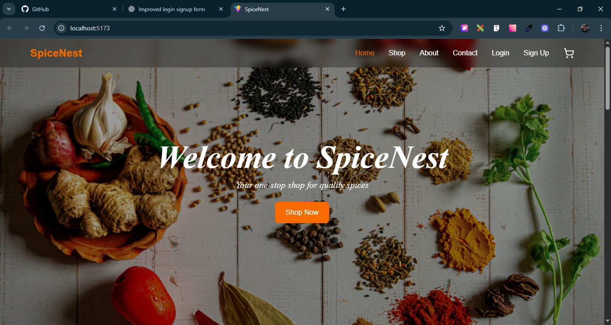
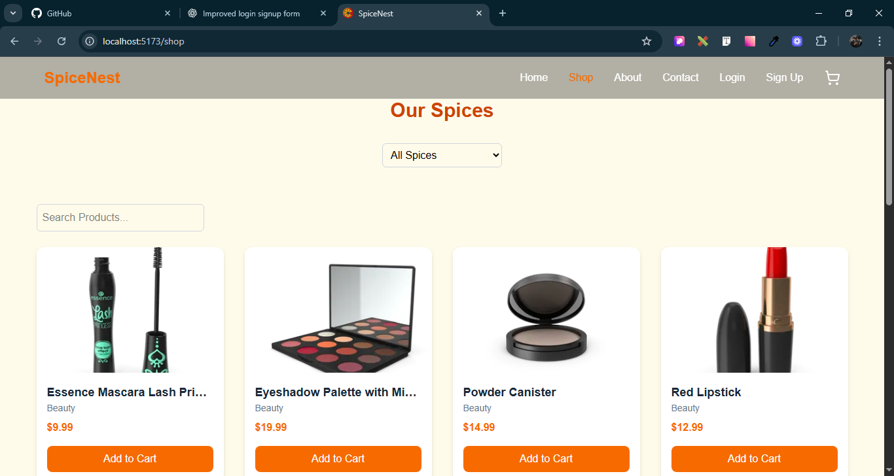
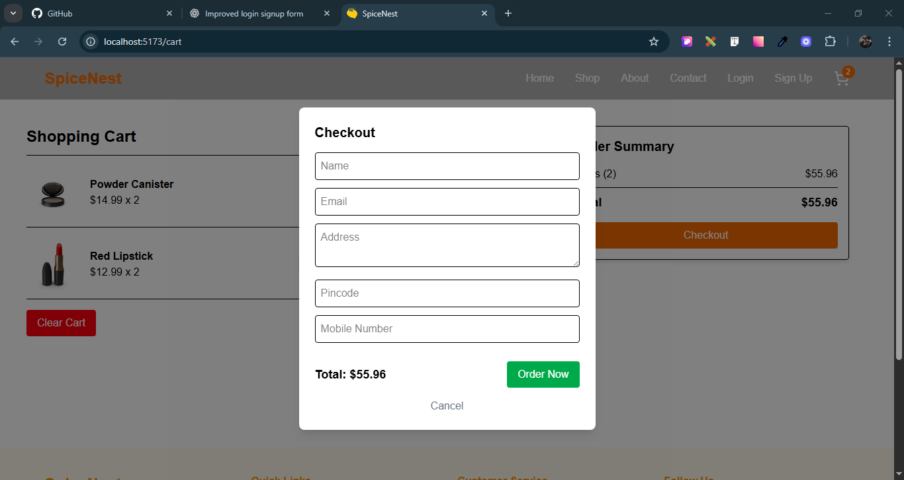
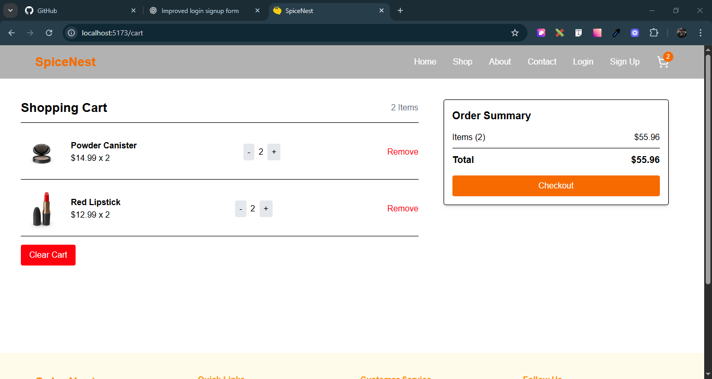
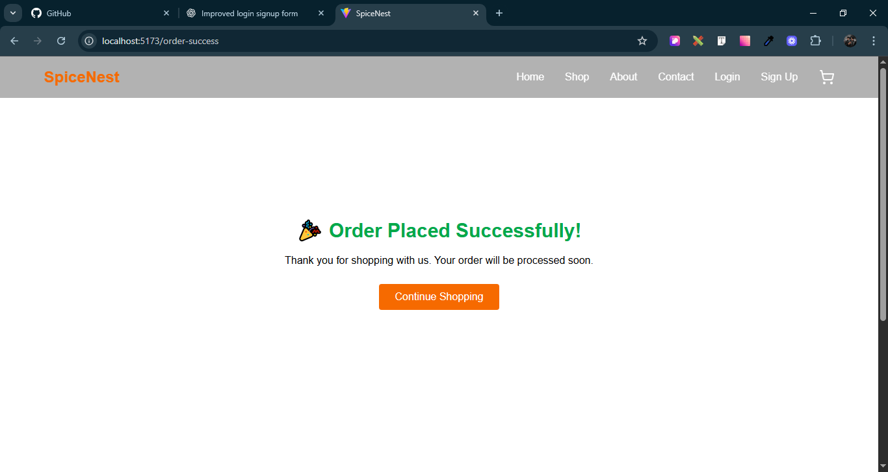

# 🛍️ Spice Store – E-Commerce Website

A modern, responsive e-commerce web app for selling spices online.  
Built with **React**, **Tailwind CSS**, **Framer Motion**, and **Firebase**.  
Includes product browsing, search, category filtering, cart management, checkout, and order storage in Firestore.

---

## 🚀 Features

- **Responsive Design** – Fully responsive with Tailwind CSS.
- **Product Listings** – Browse products with category filtering & search.
- **Product Details** – View each product's full information.
- **Cart System** – Add, remove, and update cart items.
- **Checkout Modal** – Collects name, email, address, pincode, and mobile number.
- **Order Storage** – Saves orders to Firebase Firestore.
- **Authentication** – Signup/Login using Firebase Auth.
- **Skeleton Loaders** – Smooth shimmer loading for product grids.
- **Animations** – Page & card animations via Framer Motion.

---

## 🛠️ Tech Stack

- **Frontend:** React 18, React Router DOM
- **Styling:** Tailwind CSS
- **Animations:** Framer Motion
- **Backend:** Firebase (Firestore + Auth)
- **State Management:** React Context API
- **Notifications:** React Toastify

---

## 📦 Installation

1. **Clone the repo**
   ```bash
   git clone https://github.com/yourusername/spice-store.git
   cd spice-store
   ```
   2.Folder Structure
   src/
   │── components/ # Navbar, Footer, CheckoutModal, Skeletons, etc.
   │── context/ # AuthContext, CartContext
   │── pages/ # Home, About, Shop, Cart, Login, Signup, OrderSuccess
   │── firebase.js # Firebase config
   │── App.js # Main app routes
   │── index.js # React entry point

## 📸 Screenshots

### Home Page



### Shop Page



### Checkout Modal



### Cart Page



### Order Success Page


